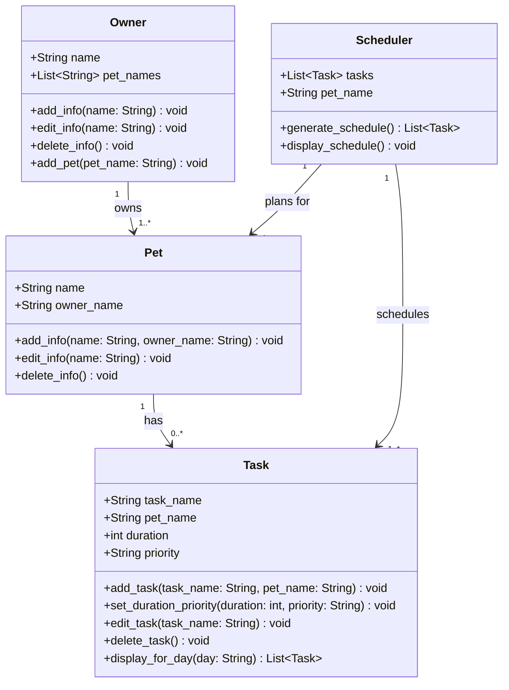

# PawPal+ Class Diagram

## Design Notes

- **Owner → Pet**: one-to-many (an owner can have multiple pets)
- **Pet → Task**: one-to-many (each pet can have multiple care tasks)
- **Scheduler → Pet**: the scheduler is scoped to a single pet's tasks at a time
- `priority` on Task is typed as `String` — common values: `"high"`, `"medium"`, `"low"`
- **Scheduler** holds `List[Task]` directly rather than parallel lists (task_names, durations, priorities), keeping task data in one place and avoiding sync issues during edits
