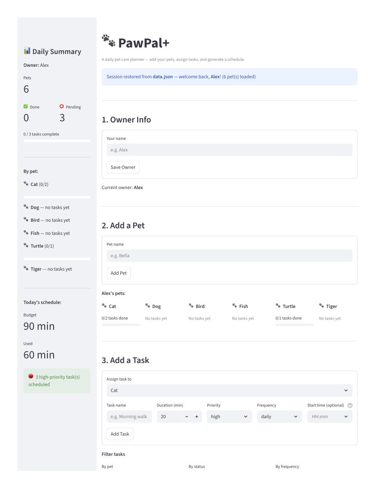
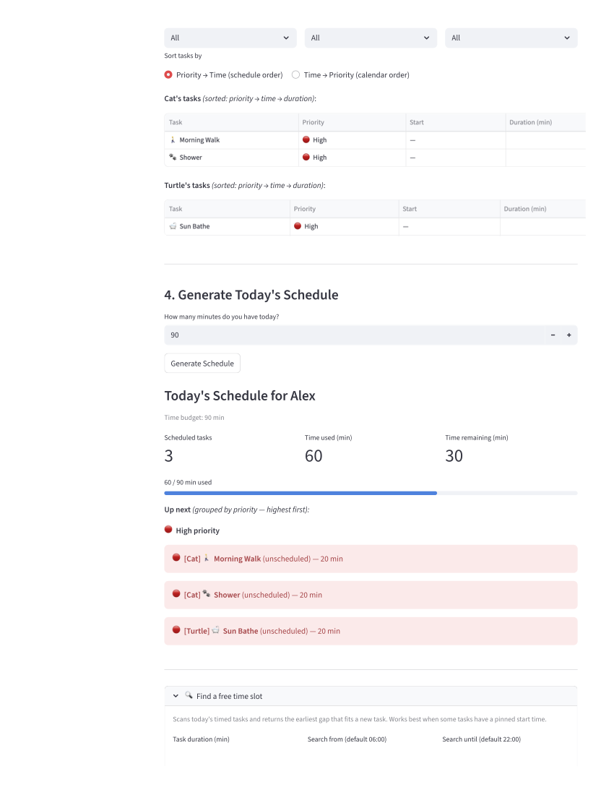

# PawPal+

A daily pet care planner built with Python and Streamlit. PawPal+ helps pet owners stay consistent with care routines by building a personalized daily schedule that respects time budgets, task priorities, and recurring care needs.

---

## Quick Start

```bash
python -m venv .venv
source .venv/bin/activate        # Windows: .venv\Scripts\activate
pip install -r requirements.txt
streamlit run app.py
```

---

## How It Works

PawPal+ is organized around four objects:

| Class | Responsibility |
|-------|---------------|
| `Owner` | Holds a list of pets; provides `get_all_tasks()` to flatten all tasks across all pets into `(Pet, Task)` pairs |
| `Pet` | Owns a list of `Task` objects; handles add, remove, lookup, and daily reset |
| `Task` | Stores one care activity (name, duration, priority, frequency, start time, completion state) |
| `Scheduler` | Reads tasks through `Owner`, applies sorting and filtering, generates schedules, and detects conflicts |

The app walks through four steps in the UI:

1. **Owner Info** — enter your name (editable at any time; pets are preserved)
2. **Add Pets** — register one or more pets (duplicate names are rejected)
3. **Add Tasks** — assign tasks to individual pets with priority, frequency, and an optional pinned start time
4. **Generate Schedule** — set a time budget and produce today's optimized plan

---

## Features

### Chronological sorting with priority and duration fallback
`Scheduler.sort_by_time()` orders tasks using a single 3-tuple sort key:

```
(start_time or ∞,  PRIORITY_ORDER[priority],  duration)
```

Tasks with an explicit `start_time` (stored as minutes from midnight, 0–1439) are placed first in chronological order. Unscheduled tasks fall after them, ordered by priority (`high → medium → low`) then by shortest duration. All three criteria are resolved in one pass — no secondary sort needed.

### Greedy schedule generation within a time budget
`Scheduler.generate_schedule()` collects every incomplete, due task, sorts them, then iterates once and greedily adds each task if its duration fits in the remaining time. The algorithm is linear in the number of tasks. When `available_minutes` is zero or negative, it short-circuits immediately and returns an empty list.

### Conflict detection with exact overlap reporting
`Scheduler.get_conflicts()` uses `itertools.combinations` to check every unique pair of timed, incomplete tasks for window overlap using the standard interval intersection test:

```
s1 < s2 + d2  AND  s2 < s1 + d1
```

`warn_conflicts()` converts each conflicting pair into a human-readable message that includes both task names, their time windows, and the exact number of overlapping minutes. In the Streamlit UI, each conflict also suggests which task to shift and by how much.

### Recurring task automation (daily, weekly, as-needed)
`Task.mark_complete()` uses `timedelta` to calculate the next due date based on frequency:

| Frequency | Next due date |
|-----------|--------------|
| `daily` | today + 1 day |
| `weekly` | today + 7 days |
| `as-needed` | none (stays complete until manually reset) |

`Scheduler.advance_day(as_of)` rolls the calendar forward by resetting every completed task whose `next_due_date` has arrived. Passing `as_of` lets tests and demos simulate any date without patching the system clock.

The `Task.is_ready` property drives scheduling: a task is included in `generate_schedule()` only when `next_due_date` is `None` (never completed) or today's date has reached or passed it.

### Task filtering
`Scheduler` exposes three read-only filter methods that return `(Pet, Task)` pairs without mutating any state:

- `filter_by_status(completed)` — pending vs. completed tasks
- `filter_by_frequency(frequency)` — `daily` / `weekly` / `as-needed`
- `get_tasks_for_pet(name)` — all tasks for a specific pet

The Streamlit task list uses these to drive its three filter dropdowns (by pet, by status, by frequency). When a schedule has been generated, the task table also displays the sort order used by the scheduler.

### Input validation at construction time
`Task.__post_init__` rejects invalid data before any object enters the system:

- `duration ≤ 0` → `ValueError`
- `start_time` outside `0–1439` → `ValueError`
- `start_time + duration > 1440` (window runs past midnight) → `ValueError`

Error messages include the exact values and a human-readable HH:MM representation so the problem is immediately actionable.

### Multi-pet support
A single `Owner` can hold any number of pets. `Owner.get_all_tasks()` is the bridge the scheduler uses — it flattens all pets' tasks into `(Pet, Task)` pairs so the scheduler always knows which pet a task belongs to without `Task` needing its own back-reference to `Pet`.

### Next-available-slot finder
`Scheduler.find_next_available_slot(duration, start_after, end_by)` scans today's timed tasks and returns the earliest gap that can fit a new task of the requested duration.

```python
slot = scheduler.find_next_available_slot(duration=30, start_after=360, end_by=1320)
# Returns start time in minutes from midnight, or None if no gap fits.
```

Algorithm (O(n log n)):

1. Collect all incomplete timed tasks and sort once by `start_time`.
2. Walk the sorted list with a `cursor` starting at `start_after` (default 06:00 = 360 min).
3. For each existing task:
   - If the task ends at or before `cursor`, skip it — it's already behind the search window.
   - If `[cursor, cursor + duration)` fits before the task begins, return `cursor`.
   - Otherwise, advance `cursor` to the task's end time.
4. After all tasks, check whether the remaining window `[cursor, end_by)` is large enough.

The scan is **O(n) after sorting** — no quadratic comparisons, no backtracking. This is distinct from `get_conflicts()` (which detects existing overlaps among already-placed tasks) — the slot finder answers the complementary question: *where can a new task go without conflicting with anything?*

In the Streamlit UI, a **Find a free time slot** panel appears in Section 4 after generating a schedule. Enter a duration, optionally narrow the search window with start/end time inputs, and click **Find Slot** to get the earliest gap.

---

## Agent Mode

Claude Code's Agent Mode (the agentic loop) was used throughout development to reason about and implement the scheduling logic. Below are the specific ways it shaped this project.

### Reviewing existing code before writing new code

For every feature addition, Agent Mode first read the relevant source files in full — `pawpal_system.py` to understand the data model, `app.py` to understand the session-state patterns and UI conventions — before proposing any changes. This prevented drift between the algorithm design and the actual class interfaces (e.g., understanding that `start_time` is `Optional[int]` minutes from midnight, not a `datetime`, before writing gap arithmetic).

### Designing `find_next_available_slot`

When implementing the slot finder, Agent Mode:

1. **Identified the right abstraction**: the problem is equivalent to finding the first gap in a set of intervals — a well-known O(n log n) scan after sorting, as opposed to a naive O(n²) pairwise check.
2. **Chose defaults with reasoning**: `start_after=360` (06:00) and `end_by=1320` (22:00) as keyword arguments rather than hardcoded constants, so the function is fully testable with any time window and usable for edge-case demos.
3. **Enumerated edge cases before the loop**: `duration <= 0`, `start_after + duration > end_by`, and the "task ends before cursor" skip condition were all identified as guards to add before the main scan, keeping the hot path readable.

### Matching the existing UI patterns

Agent Mode read the existing `time_input` usage in Section 3 (where `value=None` makes the field optional) and replicated that same pattern for the slot-finder's `start_after` / `end_by` inputs. It also matched the existing `divmod` approach for converting minutes-from-midnight back to `HH:MM` strings rather than importing the private `_mins_to_hhmm` helper.

### Placement and integration decisions

Agent Mode placed `find_next_available_slot` adjacent to `sort_by_time` in the source file (both are helper methods that operate on the task list before or around the core scheduling loop), and added the UI expander after the main schedule display so it is available as a follow-up action — "I have a new task in mind; where does it fit?"

---

## Project Structure

```
pawpal_system.py   # Core data model: Owner, Pet, Task, Scheduler
app.py             # Streamlit UI
main.py            # Console demo (no UI required)
test/
  test_pawpal.py   # Pytest tests for scheduling behaviors
class_diagram.md   # UML class diagram (Mermaid)
```

---

## Running Tests

```bash
pytest test/test_pawpal.py -v
```

Tests cover: schedule generation, priority ordering, time-budget enforcement, conflict detection, daily/weekly recurrence, `advance_day` rollover, and input validation edge cases.

---

## Demo
<a href="../images/app_screenshot_page1.png" target="_blank">
    
</a>
<a href="../images/app_screenshot_page2.png" target="_blank">
    
</a>
<a href="../images/app_screenshot_page3.png" target="_blank">
    
</a>