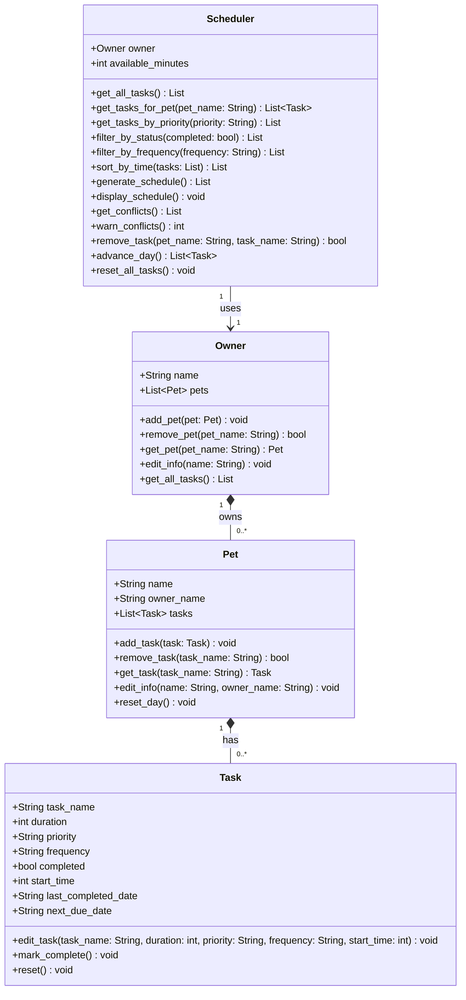

# PawPal+ Class Diagram

## Design Notes

- **Owner → Pet**: composition, one-to-many (Owner stores `Pet` objects, not name strings)
- **Pet → Task**: composition, one-to-many (Pet directly owns its tasks; Task has no back-reference to Pet)
- **Scheduler → Owner**: association, one-to-one (Scheduler holds a reference to Owner and reads all pets/tasks through it)
- `Task` is a pure value object — it holds no references to any other class
- `Owner.get_all_tasks()` is the key bridge method: it flattens all pets' tasks into `(Pet, Task)` pairs, which flow through most Scheduler methods so the pet context is never lost
- `priority` values: `"high"`, `"medium"`, `"low"`; `frequency` values: `"daily"`, `"weekly"`, `"as-needed"`
- `start_time` on Task is stored as integer minutes from midnight (0–1439); `None` means unscheduled
